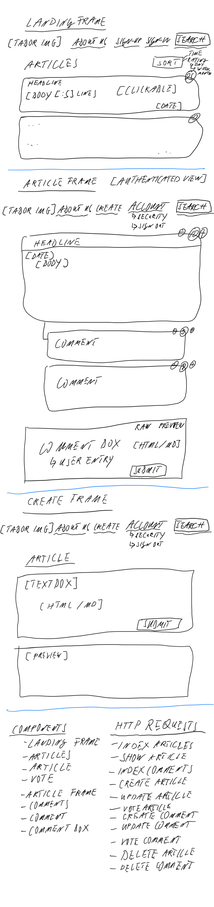

# ExTABER

## Executive Summary
+ Online platform for independent authors and investigative journalists
+ Back-end is entirely based on django, django rest framework, and PostgreSQL
+ CRUDing on 23 views and 5 models
+ Features two many-to-many relationships with two custom through models
+ 100% server-based data handling
+ Dynamic searching, filtering, and sorting across all published articles handled entirely server-side
+ Using Marked and Dompurify to allow authors to provide article content in clean markdown format

### Technologies used on the Front- and Back-End
| Technology     | Front-End | Back-End |
|----------------|-----------|----------|
| axios          | x         |          |
| bootstrap      | x         |          |
| camelcase      | x         |          |
| CSS/SCSS       | x         |          |
| dompurify      | x         |          |
| django         |           | x        |
| Heroku         |           | x        |
| HTML5          | x         |          |
| JavaScript     | x         |          |
| lodash         | x         | x        |
| marked         | x         |          |
| moment         | x         |          |
| PostgreSQL     |           | x        |
| React          | x         |          |
| react-reveal   | x         |          |
| rest framework |           | x        |
| Router-Dom     | x         |          |
| styled comp.   | x         |          |
| uuid           | x         |          |

## Introduction
ExTABER is a platform where independent investigative journalists can publish their work, create a readership, and
potentially monetise their work. The ethos underlying ExTABER is hidden in form of an anagram in its name. The
anagram is based on the epistemological viewpoint that free thought must exist **Ex** Tradition, **A**authority,
**E**established **B**relief, and **R**evelation.

## Setup & Installation Instructions
1. Fork and clone
1. npm i

## Link to Repositories & Deployed Sites
### Front-End
The repo can be found on [GitHub](https://github.com/sven-gerlach/extaber-client) whilst the deployed APP is hosted
on [AWS Amplify](https://main.d33ikcjgiasu7y.amplifyapp.com/)

### Back-End
The repo can be found on [GitHub](https://github.com/sven-gerlach/extaber-api) whilst the deployed back-end is hosted
on [Render](https://extaber-api.onrender.com)

## User Stories
As an unauthenticated user, I’d like to
- [ ] view / read articles
- [ ] see how popular articles are (up/down-vote results)

As an authenticated user, I’d like to:
- [ ] up / down vote articles
- [ ] view all comments for specific articles
- [ ] up/down-vote comments
- [ ] create/write articles
- [ ] comment on other people’s articles

As a user, I’d like to:
- [ ] search for content
- [ ] Sort search results by chronology and/or rating
- [ ] sort articles by chronology and/or rating

## List of Technologies
- JavaScript
- React/Router Dom
- HTML5
- CSS/SCSS
- styled components
- bootstrap
- axios
- uuid
- camelcase-object-deep
- marked
- dompurify
- lodash
- moment
- react-reveal

## Wireframes
This SPA React app includes 22 React components.

## Unsolved Problems
- [ ] The textarea field on the create-article frame resizes dynamically upon key entries. However, if an article is being updated (instead of newly created) and the existing field values are injected into the component state, the textarea field does not resize until a new keystroke has been entered
- [ ] The modal that appears upon hitting the article-delete button does not have a fixed background. Indeed, clicking on anything other than the two modal buttons not only causes the modal to close but also an event to bubble up causing an inadvertent click on an article which calls up that article's view
- [ ] Expand the search function

## Planning & Process Management

The Kanban for this project can be reviewed on [GitHub Projects](https://github.com/sven-gerlach/extaber-client/projects/1)

## Screenshot of the App

